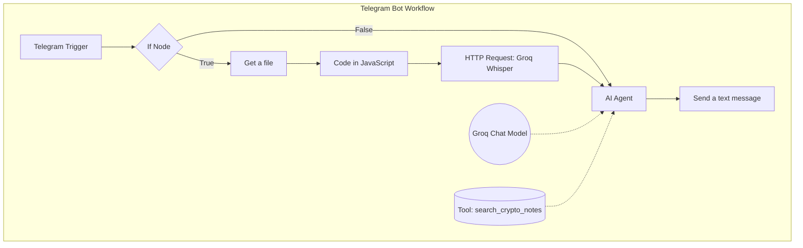
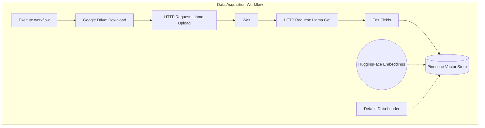

# 🧠 Multi-Modal RAG Telegram Assistant

An enterprise-grade, self-hosted Telegram AI Assistant built on n8n. This project features a dual-lane conversational interface (Text & Voice) powered by Groq's Whisper API, backed by a Pinecone Vector Database, and features an asynchronous, multimodal data ingestion pipeline capable of reading complex PDFs, PPTs, and handwritten notes via LlamaParse and Google Drive OAuth2.

## LOOM video Link

[Building a Multi-Modal RAG Assistant](https://www.loom.com/share/6d9053480f2c44de96e0efe607c13dcd)

## 🏗️ System Architecture

This project is separated into two distinct n8n workflows to ensure production stability:

### 1. The Conversational Engine (Telegram Bot)
* **The Bridge:** Persistent Ngrok tunnel exposing the local n8n instance.
* **The Router:** Dynamic conditional routing separating text messages from voice notes.
* **The Ears:** Custom JavaScript payload formatting that intercepts Telegram `.oga` files and formats them into standard `.ogg` files.
* **The Translator:** Groq API (`whisper-large-v3`) for near-instant speech-to-text transcription.
* **The Brain:** n8n AI Agent connected to a Pinecone Vector Store, utilizing RAG (Retrieval-Augmented Generation) to answer queries based on custom knowledge.

### 2. The Multimodal Ingestion Pipeline
* **Cloud Acquisition:** Google Drive API (via OAuth2) for securely pulling targeted documents.
* **The Vision Parser:** LlamaParse API asynchronous polling. Physically "looks" at complex files (scanned handwritten notes, PPTs, graphs) and translates them into machine-readable Markdown.
* **The Splitter:** Recursive Character Text Splitter (1000 chunk size / 100 overlap).
* **The Database:** Pushes chunked vector embeddings directly into the Pinecone index.


## ⚙️ Prerequisites

To run this project locally, you will need:
* **Node.js** (for running `npx n8n`)
* **Ngrok** (for the webhook tunnel)
* **API Keys:**
  * Telegram Bot Token (via BotFather)
  * Groq API Key (for Whisper-large-v3)
  * Pinecone API Key & Index Host URL
  * LlamaParse API Key
  * Google Cloud Project Client ID & Secret (for Drive OAuth2)

## 🚀 Quick Start / Boot Sequence

> **⚠️ Version Note:** This project relies on n8n version `2.9.4`. Later versions (2.10.2 - 2.15.0) introduced a core bug in the `multipart/form-data` proxy that breaks binary audio uploads to Cloudflare-protected APIs like Groq. 

### Step 1: Establish the Bridge
Open your first terminal and start your persistent Ngrok tunnel:
```bash
ngrok http --domain=YOUR-CUSTOM-NAME.ngrok-free.dev 5678
```
Keep this terminal window running in the background.

### Step 2: Boot the Engine
Open a PowerShell terminal (to prevent Windows character escaping issues). Set the webhook variable using your exact Ngrok domain, then boot the specific stable n8n version:
```powershell
$env:WEBHOOK_URL="[https://YOUR-CUSTOM-NAME.ngrok-free.dev](https://YOUR-CUSTOM-NAME.ngrok-free.dev)"
npx n8n@2.9.4
```
### Step 3: Import the Workflows
1. Navigate to `http://localhost:5678` in your browser.
2. In the n8n dashboard, go to Workflows -> Add Workflow.
3. Click the menu icon (top right) -> Import from File.
4. Import the telegram-bot-workflow.json and ingestion-pipeline.json files included in this repository.
5. Note: You will need to re-authenticate your API credentials inside the nodes (Telegram, Pinecone, Groq, Google Drive, LlamaParse) upon first import.

### Step 4: Run the Ingestion Pipeline (Phase 1)
Before the bot can answer questions, you must populate its brain.
1. Open the Data Acquisition Workflow.
2. Open the Google Drive node and input the File ID of the document/PDF you want to ingest.
3. Click Execute Workflow at the bottom of the screen.
4. The pipeline will download the file, pass it to LlamaParse (waiting 20 seconds for vision processing), convert it to Markdown, split it into chunks, and push it to Pinecone.
5. Wait for the green checkmark on the Pinecone node.

### Step 5: Activate the Telegram Bot (Phase 2)
1. Open the Telegram Bot Workflow.
2. Double-click the Telegram Trigger node and click Listen for test event (or toggle the workflow to "Active" in the top right corner).
3. Open your Telegram app and send your bot a message (text or voice note).
4. The system will automatically route the input, query the Pinecone database, and reply with context-aware answers!

### Key Technical Solves
* **The Voice Protocol Bypass:** Telegram natively outputs audio in `.oga` format, which Groq rejects. Implemented a custom JavaScript node to dynamically intercept the binary stream, calculate the mime-type, and re-envelope the payload as a standard `.ogg` file before API transmission.
* **The PDF "Blank Page" Trap:** Standard RAG setups fail on scanned documents and graphs. We bypassed standard text extractors and implemented LlamaParse's multimodal Vision engine. It physically "looks" at complex files (scanned handwriting, charts) and translates them into machine-readable Markdown.
* **Asynchronous Polling:** Built a robust POST (Drop-off) -> Wait (20s) -> GET (Pick-up) loop to accommodate LlamaParse's heavy Vision AI processing times without timing out the workflow.
* **Dynamic Expression Routing:** Implemented `{{ $json.text || $json.message?.text }}` inside the AI Agent. This allows the Agent to seamlessly ingest text regardless of whether it originated directly from Telegram (typed) or from the Groq Whisper translation node (spoken).

### Repository Structure
* `bash/workflows` - Contains the raw exported .json files for both n8n workflows.
* `bash.env.example` - Template for necessary environment variables and API keys.
* `bashREADME.md` - System architecture and execution documentation.

### Future Roadmap (Phase 3)
* [ ] Implement Window Buffer Memory for multi-turn conversational context.
* [ ] Inject custom System Prompts to establish specific AI personas (e.g., Socratic Tutor).
* [ ] Migrate local infrastructure to permanent cloud hosting (Render/Railway/Docker).
